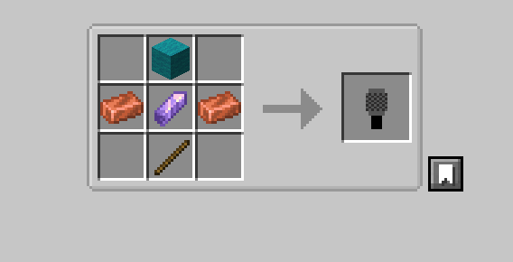

# Plotcards

A Fabric mod for Minecraft 26.2 themed around the band **The Plot in You**.
Trading cards drop from mobs you kill, and holding or collecting them unlocks
real in-game perks — buffs, playable music, and a very aggressive prop mic.

## Installing

1. Install [Fabric Loader](https://fabricmc.net/use/) 0.19.3+ for Minecraft
   26.2, with Java 25.
2. Grab the matching **Fabric API** jar and drop it in your `mods/` folder.
3. Grab `tpi_trading_cards-<version>.jar` from this repo's
   [Releases](../../releases) (or `build/libs/` if you built it yourself) and
   drop it in `mods/` too.
4. Optional: also install the **Audioplayer** mod (2.4.0+26.2) if you want
   pressed records (see below) to actually play custom song audio instead of
   just being a reskinned vanilla disc.

Everyone in the world/server needs the same mod (and Audioplayer, if used) —
it isn't client-only.

## The 17 cards

| Category | Cards |
|---|---|
| Songs (12) | Divide, Left Behind, Forgotten, Closure, Don't Look Away, Been Here Before, Pretend, All That I Can Give, Spare Me, Silence, You Get One, Carved |
| Band members (4) | Landon Tewers, Josh Childress, Ethan Yoder, Michael Cooper |
| Mascot (1) | Sox |

Each card has a rarity, shown as a colored line in its tooltip:

| Rarity | Color | Cards |
|---|---|---|
| Common | Gray | Forgotten, Been Here Before, All That I Can Give |
| Uncommon | Green | Left Behind, Closure, You Get One |
| Rare | Aqua | Don't Look Away, Pretend, Silence |
| Legendary | Gold | Divide, Spare Me, Carved, Josh Childress, Ethan Yoder, Michael Cooper |
| Mythic | Light purple | Landon Tewers, Sox |

## Getting cards

Cards drop from hostile mobs you kill — never bought or crafted from scratch.
Every card has its own independent chance to drop on every kill, so
(rarely) a single kill can drop more than one card. Roughly:

- **Common** cards: about 1-in-20 kills drops *some* common card.
- **Uncommon**: about 1-in-40 kills.
- **Rare**: about 1-in-50 kills — but see below, this is mostly meant to come
  from bonus mobs, not regular grinding.
- **Legendary**: about 1-in-75 kills, same caveat.

Three specific mobs roll a much bigger **bonus chance** for a random
Rare-or-Legendary card, on top of their normal tiny chance — this is the
intended way to actually get rares/legendaries without every zombie needing
to be a jackpot:

| Mob | Bonus chance |
|---|---|
| Enderman | 1.5% |
| Warden | 10% |
| Wither | 50% |

**Mythic** cards (Landon and Sox) share one separate, very rare roll
(0.001% per kill) — a hit picks one of the two at random. Killing the
**Ender Dragon always drops one mythic card**, guaranteed, regardless of
everything else.

**Looting helps.** Looting on the killing blow boosts every roll above
(including mythic) by 50% per level — a Looting III weapon gives 2.5x the
normal chance for everything.

Server owners can retune every chance above without a rebuild by editing
`config/tpi_trading_cards.json` (created after first launch) and restarting.
There's also a `requirePlayerKill` toggle (on by default) so mobs dying to
fire/fall/etc. don't drop cards.

## Holding a card

Cards aren't just tooltips — how you hold one changes what it does:

- **Main hand**: the card renders big and two-handed, facing the camera,
  the same way a filled map does.
- **In an item frame**: hover your crosshair over a framed card to see its
  song/artist name float up as a hologram, just like a custom-named item.
- **Off-hand**: the card grants a passive buff as long as it stays there
  (see below) — this is the only slot that grants buffs.

## Off-hand buffs

Hold a card in your off-hand and it quietly applies effects every half
second, no activation needed:

| Card | Effect(s) |
|---|---|
| Common song | Speed I |
| Uncommon song | Haste I |
| Rare song | Strength I |
| Legendary song | Speed II + Resistance I |
| Any band member | Night Vision + Health Boost I (2 hearts) |
| Landon Tewers | All of the above, **plus** Hero of the Village I |
| Sox | Dolphin's Grace I + Jump Boost I + Speed II + Absorption II (4 hearts) |

Band member cards get one more trick: they also grant whatever song effect
matches the **highest-rarity song card you own anywhere in your inventory**
(not necessarily held) — so pairing, say, Landon in your off-hand with a
Legendary song card sitting in your inventory stacks that song's buff on
top automatically. It doesn't stack twice from multiple song cards — just
the single best one counts.

## Pressing a record

Collect **nine copies of the same song card** and combine them at a
crafting table to press that song into a real, playable music disc —
custom name and all. Drop it in a jukebox like any vanilla disc. With the
**Audioplayer** mod installed alongside this one, the disc plays that song's
actual audio; without it, it still works as a normal (silent-track) disc
with the right name on it.

## The microphone

A craftable prop for the true frontman experience:



Any wool color works on top — copper ingot on each side, amethyst shard in
the middle, stick on the bottom.

- **Place it** on a floor, wall, or ceiling and it orients itself to match
  the surface, just like an End Rod.
- **Right-click** while holding it (not aimed at a surface) to "sing" into
  it — plays the eating-style animation for a few seconds, no item consumed.
- **Hit an entity with it** and they go flying — 3 damage plus a huge
  knockback impulse, roughly 10 blocks on open ground (less over rough
  terrain or against knockback-resistant mobs, same physics as any other
  knockback).
- **Enchantable** at an enchanting table or anvil just like a sword —
  Sharpness, Knockback, Looting, Fire Aspect, Sweeping Edge, Unbreaking,
  Mending, and Curse of Vanishing all apply.
- **Can't break blocks** — same restriction real swords have, so swinging
  it at something (or clicking in creative) never destroys terrain.
- **Autotune voice effect**: with [Simple Voice Chat](https://modrepo.de/minecraft/voicechat/overview)
  also installed, holding the mic in either hand while you talk detects your
  pitch and snaps it instantly to the nearest note — the classic hard-snap
  "autotune" sound everyone nearby hears you singing through. No SVC
  installed, no effect, no crash either way — this is a soft integration
  (see `net.tpi.tradingcards.voicechat`).

## Achievements

- **The Plot in You** — craft a crafting table (the root achievement).
- One achievement per song, awarded the first time you press that song's
  disc (12 total).
- **The Full Discography** — press all 12 songs.
- **Crowd Control** — craft a microphone for the first time.

## Tuning / config reference

`config/tpi_trading_cards.json`:

```json
{
  "commonCardDropChance": 0.0166667,
  "uncommonCardDropChance": 0.0083333,
  "rareCardDropChance": 0.0066667,
  "legendaryCardDropChance": 0.0022222,
  "mythicCardDropChance": 0.00001,
  "endermanRareOrLegendaryBonusChance": 0.015,
  "wardenRareOrLegendaryBonusChance": 0.10,
  "witherRareOrLegendaryBonusChance": 0.50,
  "requirePlayerKill": true,
  "lootingBonusPerLevel": 0.5
}
```

Each chance is a fraction of 1.0, applied per hostile mob kill,
independently per card. Restart the server (or reload the world) after
editing.

## Building from source

Requires JDK 25. `./gradlew build` from the repo root; the jar lands in
`build/libs/`.

The microphone's autotune effect depends on [Simple Voice Chat's](https://modrepo.de/minecraft/voicechat/overview)
addon API, which isn't published as a standalone Maven artifact anywhere -
`build.gradle` vendors it locally from an installed copy of the mod (see the
comment there for how to regenerate `libs/voicechat-api-<version>.jar` if
you're building on a machine that's never had it).

## Licensing

This mod's own code is CC0-1.0 (see `LICENSE`). It bundles
[TarsosDSP](https://github.com/JorenSix/TarsosDSP) (pitch detection and
shifting for the microphone's autotune effect), which is GPL-3.0 licensed -
as a result, the *distributed jar* as a whole is subject to GPL-3.0 terms,
even though the original source in this repo remains CC0.
